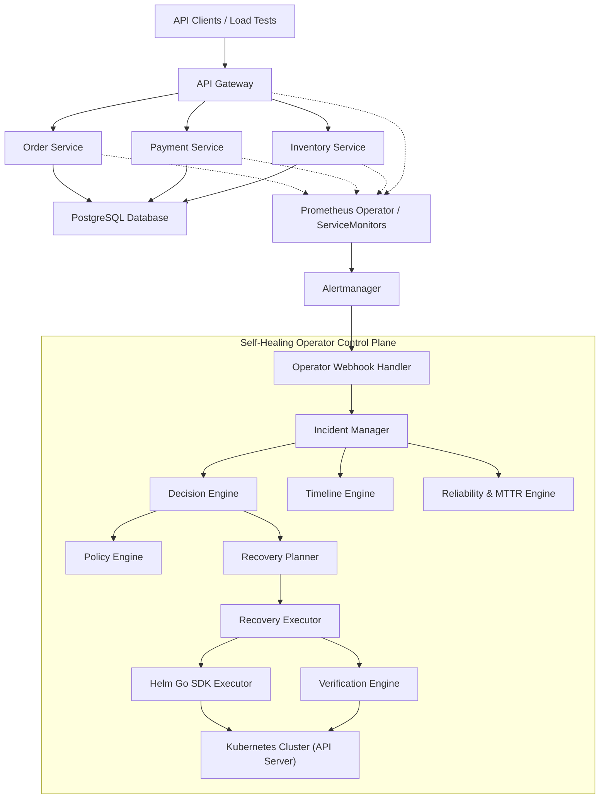
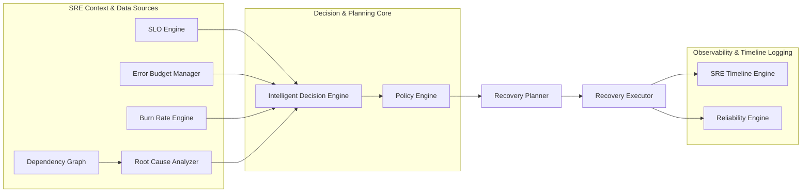
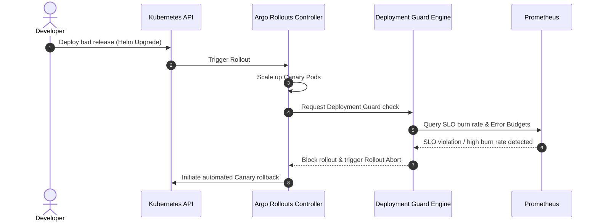
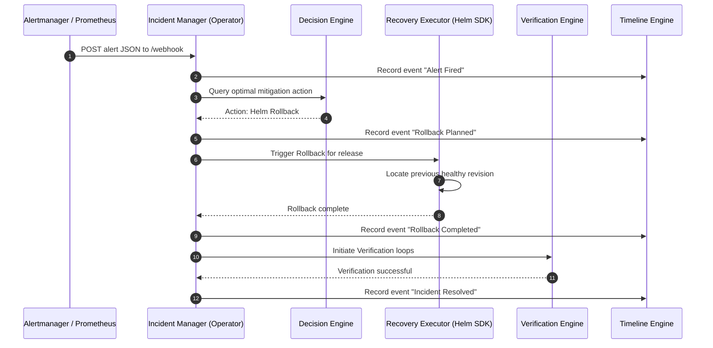
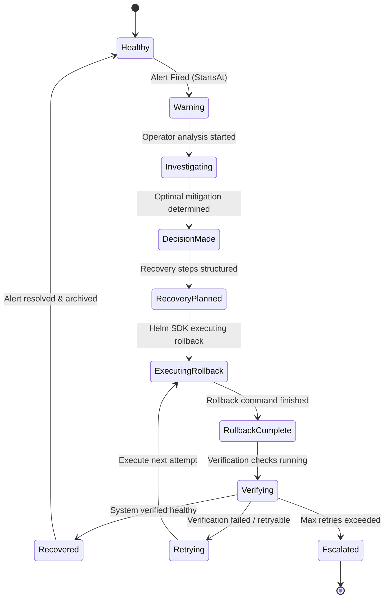
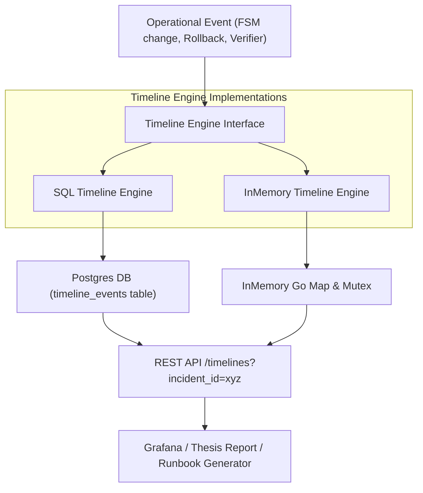

# Architectural Visualization Diagrams

This document contains Mermaid.js visualizations mapping out the architecture, lifecycles, and flows of the self-healing cloud-native operator platform.

## 1. Overall System Architecture

---

## 2. Operator Internal Components & Dependency Wiring

---

## 3. Progressive Delivery Canary Deployment Flow (Argo Rollouts)

---

## 4. Automated Recovery Flow (Self-Healing Loop)

---

## 5. Incident Lifecycle & FSM Transitions

---

## 6. SRE Timeline & Analytics Logging Engine

