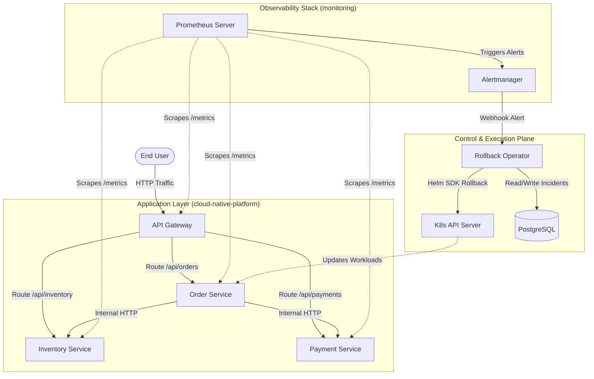
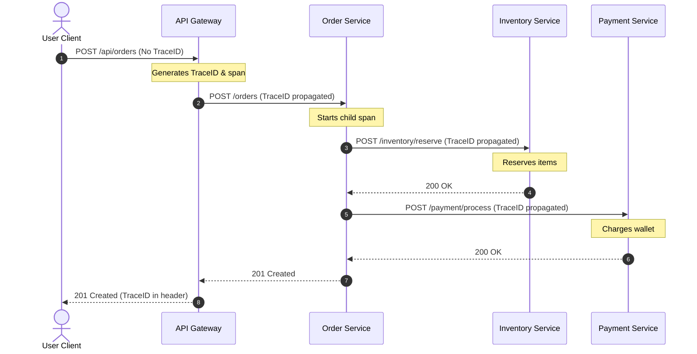
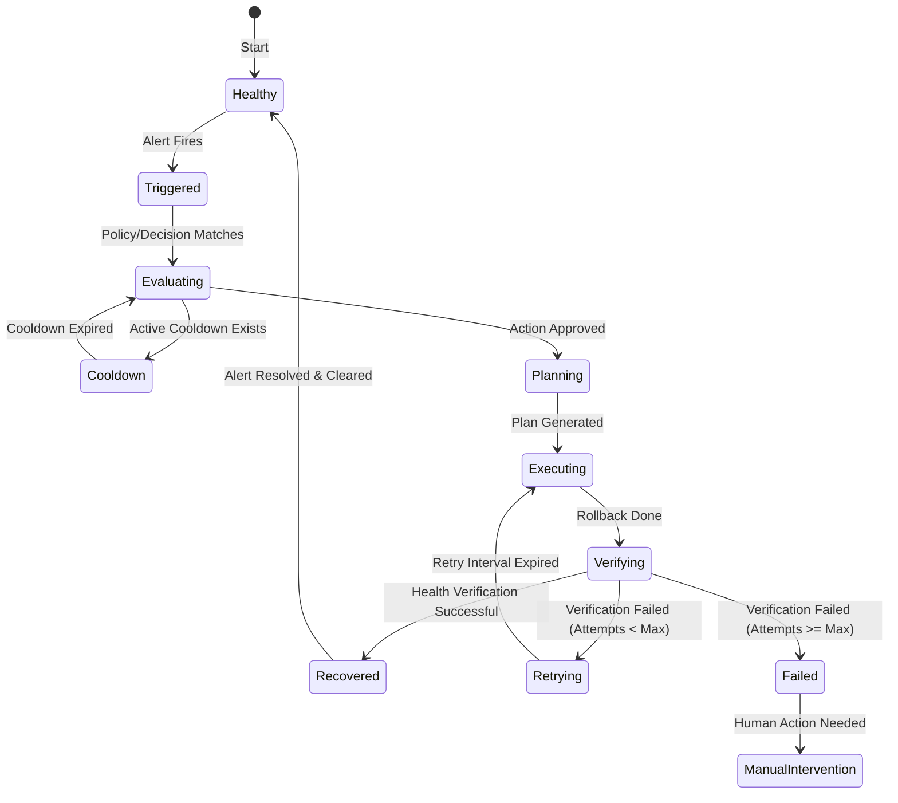
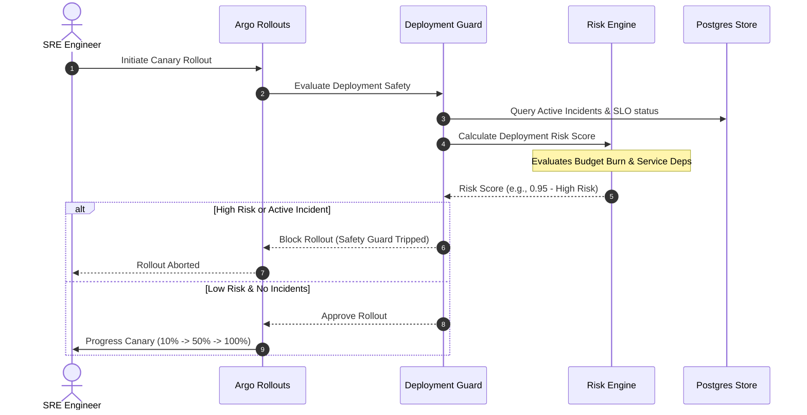

# Platform & Operator Architecture Specification

This document details the high-level system architecture, microservice communication model, operator design, SRE decision/recovery engines, and runtime lifecycles.

---

## 1. System Architecture Overview

The Self-Healing Platform consists of an API Gateway, core business microservices, a custom Kubernetes Operator, a dedicated PostgreSQL store for incident tracking, and a Prometheus-based observability stack.



---

## 2. Microservice Communication & Spans

Distributed tracing uses OpenTelemetry (OTel) with W3C propagation. The API Gateway generates `TraceID`s (if not present) and propagates them downstream.



---

## 3. Operator Internal Architecture

The Rollback Operator acts as a custom controller. It consists of multiple independent engines executing in an asynchronous pipeline:

```mermaid
graph LD
    AM[Alertmanager] -->|Webhook| WebhookHandler[Webhook Handler]
    WebhookHandler -->|Parse Alert| IncidentMgr[Incident Manager]
    
    subgraph "SRE Control Plane"
        IncidentMgr -->|Query SLOs| SLO[SLO Manager]
        IncidentMgr -->|Check Burn Rate| BurnRate[Burn Rate Engine]
        IncidentMgr -->|Check Budget| Budget[Error Budget Manager]
        IncidentMgr -->|Analyze Dependencies| DepGraph[Dependency Graph]
        IncidentMgr -->|Find Root Cause| RCA[Root Cause Analyzer]
    end

    subgraph "Policy & Decision Engines"
        IncidentMgr -->|Evaluate Policies| Policy[Policy Engine]
        IncidentMgr -->|Compute Confidence| Decision[Decision Engine]
    end

    subgraph "SRE Execution Plane"
        IncidentMgr -->|Create Recovery Plan| Planner[Recovery Planner]
        IncidentMgr -->|Execute Plan| Executor[Recovery Executor]
        Executor -->|Call Helm SDK| HelmSDK[Helm Go SDK]
        Executor -->|Verify Health| Verifier[Verification Engine]
        Executor -->|Handle Failures| Retry[Retry Engine]
    end

    IncidentMgr -->|Audit History| DB[(PostgreSQL)]
    IncidentMgr -->|Timeline Audit| Timeline[Timeline Engine]
    IncidentMgr -->|Generate Recommendations| RecEngine[Recommendation Engine]
```

---

## 4. Incident Lifecycle State Machine

Each firing alert generates an incident that progresses through a strict state machine:



---

## 5. Deployment Guard & Progressive Delivery Flow

When a new canary release is initiated (e.g. via Argo Rollouts), the operator evaluates system risk and blocks dangerous deployments:


