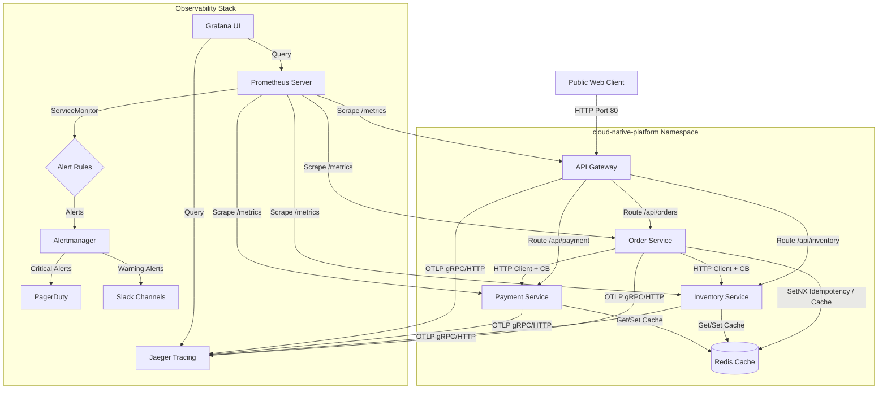
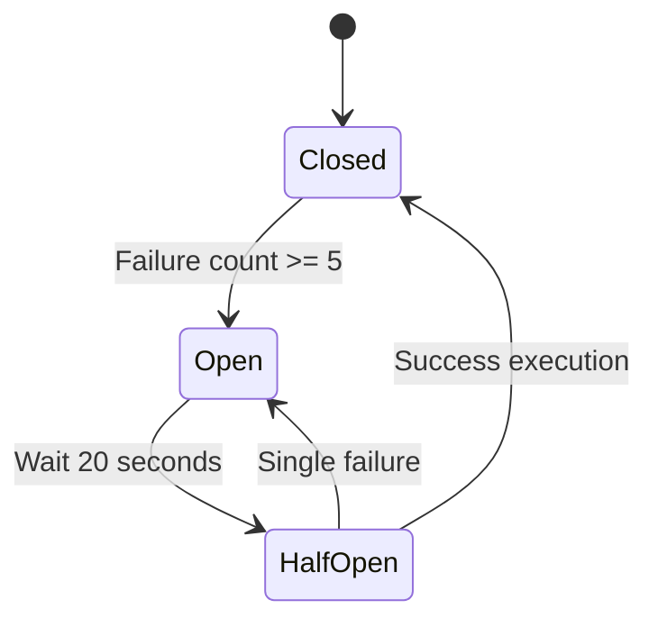

# Phase 3: Cloud-Native platform Architecture

This document outlines the architecture, components, and telemetry designs for Phase 3 of the Cloud-Native microservices platform.

## Architecture Diagram



## Component Flow Details

### 1. Distributed Tracing Flow
*   The **API Gateway** starts a server trace span on receiving a request using `middleware.TraceID(serviceName)`.
*   Downstream request contexts inject the span traceparent header conforming to the **W3C trace context format** (e.g. `traceparent: 00-4bf92f3577b34da6a3ce929d0e0e4736-00f067aa0ba902b7-01`).
*   **Order**, **Inventory**, and **Payment** services parse the context using the standard W3C text map propagator, starting matching server spans. Custom spans wrap core business operations like DB reads, payment simulator executions, and inventory reserves.

### 2. Circuit Breakers

*   Configured on:
    *   `Gateway` → `Order Service`
    *   `Gateway` → `Inventory Service`
    *   `Gateway` → `Payment Service`
    *   `Order Service` → `Inventory Service`
    *   `Order Service` → `Payment Service`
*   If the downstream endpoint fails 5 times, the circuit shifts to `OPEN` and immediately rejects subsequent traffic. A background timer shifts it to `HALF_OPEN` after 20 seconds to allow verification traffic.

### 3. Redis Integration
*   **Idempotency Locks**: Order creations perform atomic `SET <key> PROCESSING NX` checks. On success, the order creation progresses. On finish, the key's value changes to the JSON response. Subsequent duplicate requests are answered immediately from Redis.
*   **Read Caching**: Item details and payment queries are cached in Redis with a 5-minute TTL. Cache invalidation runs automatically on updates (Reserve, Release, Refund).

### 4. Kubernetes Security & Scaling
*   Containers run with a read-only root file system, drop all Linux privileges (`capabilities: drop: [ALL]`), and execute under non-root user accounts.
*   **Horizontal Pod Autoscaler (HPA)** scales the pods from 2 to 10 replicas automatically when average CPU hits 70% or memory hits 80%.

---

## Deployment & Verification Guide

### 1. Local Verification (Docker Compose)
To boot up the complete environment including Redis and Jaeger:
```bash
docker-compose up --build -d
```
You can view active traces in Jaeger at `http://localhost:16686` and query metrics at `http://localhost:8000/metrics`.

### 2. Kubernetes Deployment
Ensure a K8s cluster is active:
```bash
kubectl apply -f k8s/namespace.yaml
kubectl apply -f k8s/redis/
kubectl apply -f k8s/gateway/
kubectl apply -f k8s/order/
kubectl apply -f k8s/inventory/
kubectl apply -f k8s/payment/
kubectl apply -f k8s/monitoring/
```
Verify pods are running:
```bash
kubectl get pods -n cloud-native-platform
```
