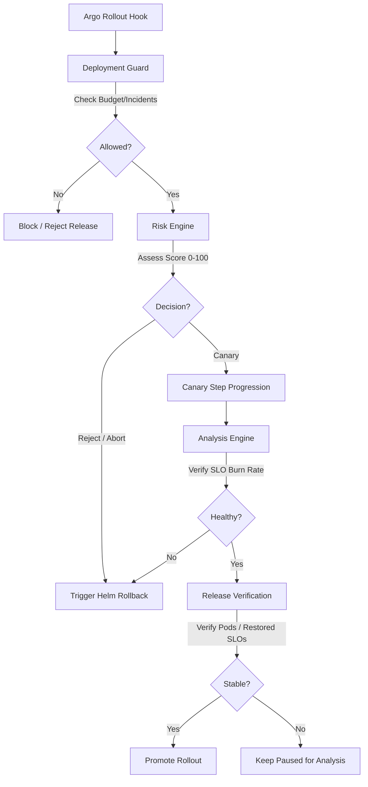

# Phase 6: Progressive Delivery & Deployment Guard

This documentation outlines the architecture, sub-engines, and APIs of the **Progressive Delivery & Deployment Guard Engine** integrated within the Self-Healing Kubernetes Operator.

---

## 1. System Architecture

The Progressive Delivery module hooks directly into the **Argo Rollouts** CRD controller lifecycle using a Kubernetes Go clientset, verifying the safety and telemetry of new releases before promoting them.

---

## 2. Core Engines

### 2.1. Deployment Guard (`guard.go`)
Before any canary rollout starts, the Guard verifies the cluster safety state:
*   **Active Incidents**: Blocks deployment if any critical active incidents exist on the target service.
*   **Error Budget**: Blocks if remaining budget is below the minimum threshold (e.g. 10.0%).
*   **Burn Rate**: Blocks if current burn rate is above threshold.
*   **Dependencies**: Blocks if any downstream dependencies are currently violating SLOs.

### 2.2. Risk Engine (`risk.go`)
Calculates a risk score from `0` (no risk) to `100` (block deployment) based on:
*   Remaining budget percent.
*   Current burn rate.
*   History of failed Helm rollbacks or verifications.
*   Number of downstream dependencies.

### 2.3. Analysis Engine (`analysis.go`)
Performs real-time telemetry analysis of the candidate version against the stable version:
*   Compares availability and latency ratios.
*   Checks if the candidate is triggering budget exhaustion or violating SLO targets.
*   Determines if the rollout should be automatically aborted.

### 2.4. Release Verification Engine (`verification.go`)
Evaluates:
*   Whether all Kubernetes Pods for the candidate version are in `Ready` state.
*   Whether the service's Golden Signal metrics conform to SLO targets before promoting to 100% traffic.

---

## 3. HTTP REST API Endpoints

The operator exposes progressive delivery state and query APIs:

| Endpoint | Method | Description |
|---|---|---|
| `/rollouts` | `GET` | List all tracked progressive rollouts |
| `/rollouts/{id}` | `GET` | Get details and state of a specific rollout |
| `/deployments/history` | `GET` | List complete historical records of deployments |
| `/deployment-risk?service={service}` | `GET` | Calculate current risk assessment for a service |
| `/promotion-history` | `GET` | Get history of successfully promoted releases |
| `/canary` | `GET` | Get list of actively running canary releases |

---

## 4. Promethean Metrics

The engine publishes the following telemetry to `/metrics`:

*   `operator_rollouts_total`: Total count of progressive delivery rollouts started.
*   `operator_rollout_duration_seconds`: Histogram of rollout completion durations.
*   `operator_rollout_failures_total`: Total progressive delivery rollout failures.
*   `operator_canary_analysis_total`: Count of canary evaluations.
*   `operator_canary_success_total` / `operator_canary_failures_total`: Telemetry analysis outcomes.
*   `operator_promotions_total` / `operator_aborts_total`: Promotion vs Abort counts.
*   `operator_deployment_risk_score`: Latest deployment evaluation risk score.
*   `operator_deployment_guard_blocks_total`: Deployments blocked by the guard policy.
