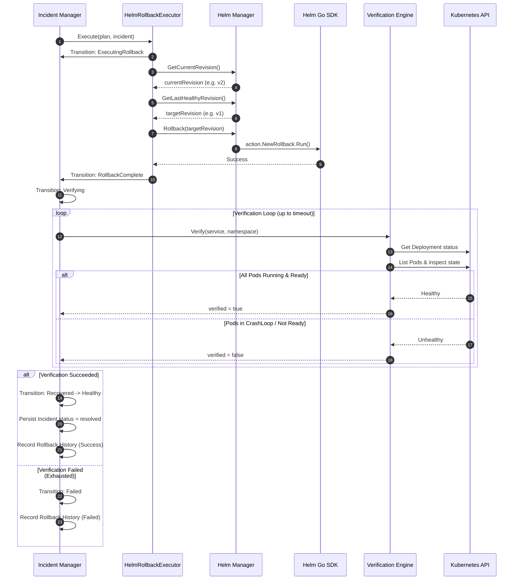

# Self-Healing Execution Plane (Phase 4B)

This document details the **Self-Healing Execution Plane**, which executes and verifies the structured `RecoveryPlan` decisions generated by the Control Plane using the official **Helm Go SDK**.

---

## 1. Architecture Overview

```
RecoveryPlan (Created by Control Plane)
      │
      ▼
Incident Manager (Orchestrator Pipeline Loop)
      │
      ├──────────────────────────────┐
      ▼                              ▼
HelmRollbackExecutor         K8sVerificationEngine
      │                              │
      ▼                              ▼
Helm Go SDK                  Kubernetes API (client-go)
      │                              │
      ▼                              ▼
Rollback Execution           Resource Readiness & Health
```

---

## 2. Component Design & Package Responsibilities

### A. Helm Integration (`internal/operator/helm`)
- **`HelmManager` Interface**: Decouples SDK calls from execution orchestrators.
- **Helm Go SDK usage**:
  - `helm.sh/helm/v3/pkg/action`: Core action handlers (e.g. `NewList`, `NewGet`, `NewHistory`, `NewRollback`).
  - `helm.sh/helm/v3/pkg/cli`: Sets up environment contexts.
  - `helm.sh/helm/v3/pkg/release`: Representation of release entity statuses and revisions.
  - `k8s.io/cli-runtime/pkg/genericclioptions`: Configuration provider mapping client options to Kubeconfig.

### B. Release History Manager (`internal/operator/helm/manager.go`)
- Rather than blindly rolling back to `currentRevision - 1`, the engine fetch history and scans backwards:
  - Skips the currently failing version.
  - Identifies the latest revision with `status == release.StatusDeployed`.
  - Asserts that it is a safe target before triggering the rollback action.

### C. Recovery Executor (`internal/operator/executor`)
- **`RecoveryExecutor` Interface**: Prevents massive, hard-to-maintain switch statements.
- **`HelmRollbackExecutor`**: Focuses purely on driving the state machine to `ExecutingRollback`, performing the rollback, and transitioning to `RollbackComplete`.
- Extensible for future executors (e.g., `RestartExecutor`, `ScaleExecutor`, `CanaryExecutor`).

### D. Verification Engine (`internal/operator/verification`)
- **`VerificationEngine` Interface**: Verifies recovery health post-rollback.
- **`K8sVerificationEngine`**:
  - Checks if Deployment has the desired ready replicas.
  - Lists Pods using Selector labels.
  - Ensures each pod is `Running` and all containers are `Ready`.
  - Asserts no container is in `CrashLoopBackOff` or has error wait reasons (e.g., `ImagePullBackOff`).

### E. Retry Engine (`internal/operator/retry`)
- Implements exponential backoff: `baseDuration * 2^(attempt-1)`.
- Classifies failures:
  - **Transient Errors**: Retryable (e.g. connection resets, network timeouts).
  - **Non-Transient Errors**: Immediate abort (e.g. `release not found`, `namespace not found`, `revision not found`).

---

## 3. Sequence Workflow (Phase 4B)



---

## 4. Prometheus Metrics & Grafana Dashboard

We expose the following SRE metrics:
- `operator_rollbacks_total`: Counter tracking executed rollbacks by service.
- `operator_failed_rollbacks_total`: Counter tracking failed rollbacks.
- `operator_verifications_total`: Counter tracking verification runs.
- `operator_verification_failures_total`: Counter tracking verification failures.
- `operator_recovery_duration_seconds`: Histogram tracking total time to resolve.
- `operator_last_successful_rollback`: Gauge timestamp of the last success.
- `operator_retry_total`: Counter tracking recovery attempts.
- `operator_active_recoveries`: Gauge tracking running recoveries.
