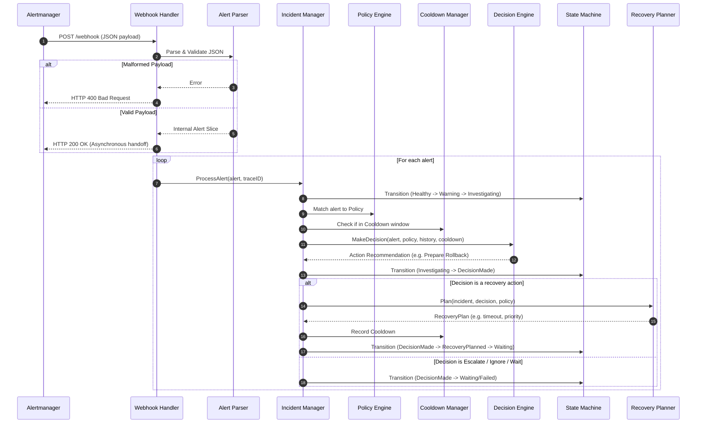
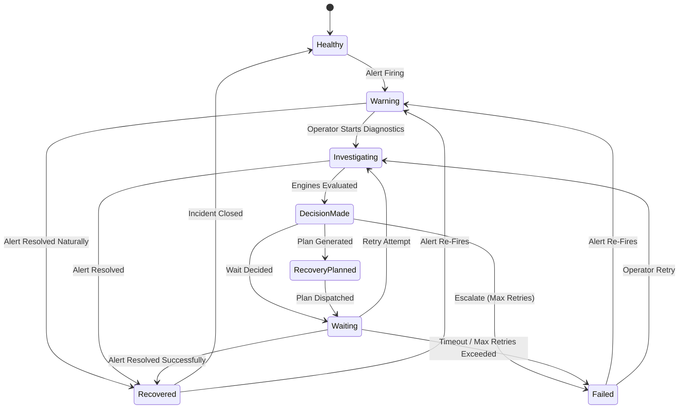
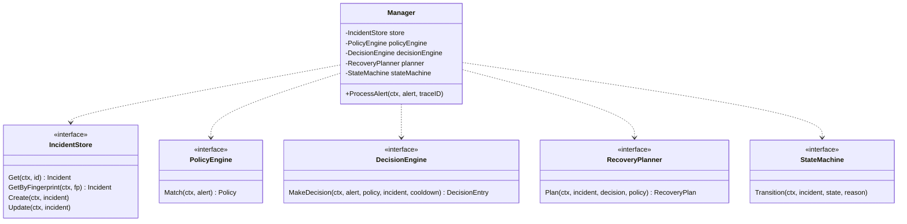

# Self-Healing Platform Control Plane (Phase 4A Operator)

This document provides a comprehensive overview of the **Self-Healing Control Plane Operator**, acting as the "brain" of the platform. Its primary responsibility is to consume Alertmanager webhooks, track incidents, match them against policies, execute a state machine, and compile structured **Recovery Plans** to be consumed by the execution plane (Phase 4B).

---

## 1. Directory & Package Structure

The operator is organized with isolated responsibilities:

```
cmd/operator/
  main.go                     # Entrypoint, dependency injection, HTTP boot
internal/operator/
  alert/
    parser.go                 # Webhook JSON validation & model parsing
  config/
    config.go                 # Environment configurations & default policy registry
  logger/
    logger.go                 # Contextual structured logger injecting Trace ID, Incident, State
  interfaces/
    interfaces.go             # Storage and engine decoupled contract definitions
  models/
    models.go                 # Strongly-typed domain models (Alert, Incident, Plan, etc.)
  webhook/
    handler.go                # POST /webhook controller with Trace ID propagation
  incident/
    manager.go                # Pipeline orchestrator managing incident lifecycles
  policy/
    engine.go                 # Matchmaker mapping alert targets to recommended actions
  decision/
    engine.go                 # Brain resolving cooldowns, limits, policies to decisions
  planner/
    planner.go                # Compiler translating decisions into RecoveryPlans
  state/
    machine.go                # FSM enforcing validated incident state transitions
  storage/
    inmemory.go               # Thread-safe local storage (replaces with Postgres later)
  utils/
    cooldown.go               # Thread-safe cooldown window manager
  metrics/
    metrics.go                # Custom Prometheus metrics registration
```

### Why each package exists:
- **`models`**: Enforces Go strict-typing across the control plane. Prevents typing mistakes associated with `map[string]interface{}`.
- **`alert`**: Decouples network JSON parsing from business operations. Performs validation and rejects malformed requests immediately.
- **`webhook`**: Isolates network protocol details (HTTP handlers, status codes). Handles trace context creation.
- **`incident`**: Orchestrates the pipeline. Coordinates storage updates, policy matching, state FSM steps, and planner execution.
- **`policy`**: Contains policy configurations mapping alerts to actions. Kept modular to support external DB storage or ConfigMap loading.
- **`decision`**: Solves complex logical checks (limit constraints, cooldown periods, retries) and decides the action.
- **`planner`**: Compiles the desired action, verification windows, timeouts, and priorities into a schema ready for execution.
- **`state`**: Regulates transition validations. Ensures an incident cannot skip workflow steps (e.g. from Firing to Recovered without investigation).
- **`storage`**: Abstracts persistent state, decoupling code logic from PostgreSQL or memory databases.
- **`utils`**: Tracks key-based cooldown windows to prevent thrashing.
- **`metrics`**: Exposes internal operational health (alerts, transitions, plans) via Prometheus.

---

## 2. Webhook intake and Pipeline Sequence



---

## 3. Finite State Machine (Incident Lifecycle)



*   **Transitions Enforced**: The `StateMachine` checks every change against allowed paths. Attempting to force an illegal state transition immediately rejects the attempt and returns a concrete error.

---

## 4. Class / Component Diagram


