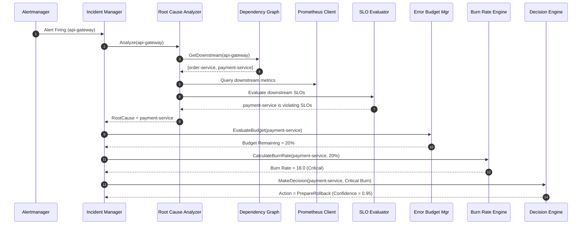

# SRE Decision Engine (Phase 5)

This document describes the **Intelligent SRE Control Plane** built for the Self-Healing Kubernetes Operator. Instead of reacting directly to raw Alertmanager alerts, the operator leverages Site Reliability Engineering (SRE) principles to determine if recovery is necessary, verify service health, identify true root causes in cascading failures, and evaluate decision confidence.

---

## 1. Architecture Flow

```
                  Alertmanager Alert
                         │
                         ▼
             [1. Root Cause Analyzer] ◄───► [5. Dependency Graph]
                         │
                         ├────────────────────────┐
                         ▼                        ▼
                 (Target Service)         (Cascading Service)
                         │
                         ▼
             [2. Prometheus Query Engine]
                         │
                         ├────────────────────────┬────────────────────────┐
                         ▼                        ▼                        ▼
                [3. SLO Evaluator]    [4. Error Budget Mgr]    [5. Burn Rate Engine]
                         │                        │                        │
                         └────────────────────────┼────────────────────────┘
                                                  │
                                                  ▼
                                      [6. Decision Engine]
                                                  │
                                                  ▼
                                            Recovery Plan
```

---

## 2. Component Design & Mathematical Formulations

### A. Prometheus Query Engine (`internal/operator/prometheus`)
Exposes interfaces for retrieving system Golden Signals (Latency, Availability, Error Rate, Traffic, CPU, and Memory usage). It runs standard PromQL templates against the Prometheus HTTP API.

### B. SLO Manager (`internal/operator/slo`)
Loads objectives (Latency P95 Max, Availability Target, Error Rate Max, Throughput Min) from configuration and evaluates actual metrics.
- **Availability Target**: e.g., $99.9\%$ ($0.999$).
- **Latency P95 Target**: e.g., $< 300\text{ms}$.

### C. Error Budget Manager (`internal/operator/budget`)
Computes the allowed and consumed errors over sliding SRE windows ($1\text{h}$, $6\text{h}$, $24\text{h}$, $7\text{d}$, $30\text{d}$):
- **Allowed Failure Rate**: $F = 1 - A$ (where $A$ is the Availability Target).
- **Total Request count**: $N = \text{Throughput} \times \text{Window Duration (seconds)}$.
- **Allowed Errors**: $E_{\text{allow}} = N \times F$.
- **Consumed Errors**: $E_{\text{consumed}} = N \times \text{Error Rate}$.
- **Remaining Budget \%**: $B_{\text{rem}} = \frac{E_{\text{allow}} - E_{\text{consumed}}}{E_{\text{allow}}} \times 100$.

### D. Burn Rate Engine (`internal/operator/burnrate`)
Computes the error budget burn rate:
- **Burn Rate**: $BR = \frac{\text{Actual Error Rate}}{1 - A}$.
- **Time to Exhaustion**: $T_{\text{exhaustion}} = \frac{B_{\text{rem}}}{100} \times \frac{720\text{ hours}}{BR}$ (based on a standard 30-day budget window).
- **Multi-Window Alerts**:
  - $1\text{h}$ window: Burn Rate $> 14.4$ (consumes $2\%$ budget in 1 hour) $\rightarrow$ Trigger immediate recovery.
  - $6\text{h}$ window: Burn Rate $> 6.0$ (consumes $5\%$ budget in 6 hours).

### E. Dependency Graph (`internal/operator/dependency`)
Models system topology to map services and their dependencies:
```
api-gateway ──► order-service ──┬──► inventory-service
                                └──► payment-service
```
Traces downstream (children) and upstream (parents) nodes recursively.

### F. Root Cause Analyzer (`internal/operator/rootcause`)
Solves cascading issues. If `api-gateway` triggers an alert, the analyzer evaluates the SLO status of downstream services (`order-service`, `payment-service`). If `payment-service` is violating its SLO, it is isolated as the true root cause.

### G. SRE-Driven Decision Engine (`internal/operator/decision`)
Makes intelligent choices:
1. **Redirect Recovery Target**: Performs recovery action on the root cause service instead of the alerted service.
2. **Failure Analysis History**: If history records show consecutive failed rollbacks for the service, overrides action to **Escalate** to prevent infinite retry loops.
3. **Burn Rate Override**:
   - High burn rate ($> 14.4$) $\rightarrow$ Execute immediate rollback.
   - Low burn rate ($< 2.0$) $\rightarrow$ Delay action and **Observe** (Wait).

---

## 3. Sequence Diagram



---

## 4. Package Responsibilities

| Package | Responsibility |
|---|---|
| `internal/operator/prometheus` | Interface and client wrapper for the Prometheus HTTP API. |
| `internal/operator/slo` | Configuration and runtime evaluations of SLO targets. |
| `internal/operator/budget` | Computes error budgets (consumed, remaining, allowed). |
| `internal/operator/burnrate` | Computes SRE burn rate coefficients and projections. |
| `internal/operator/dependency` | Stores service DAG and traces upstream/downstream trees. |
| `internal/operator/rootcause` | isolates true culprit service in cascading degradations. |
| `internal/operator/decision` | SRE-driven heuristic decision engine with history & confidence. |
| `internal/operator/metrics` | Defines & registers SRE Prometheus operator metrics. |
